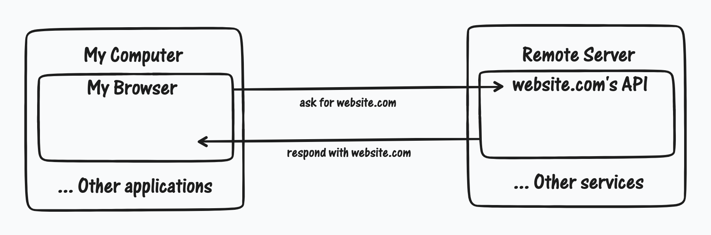
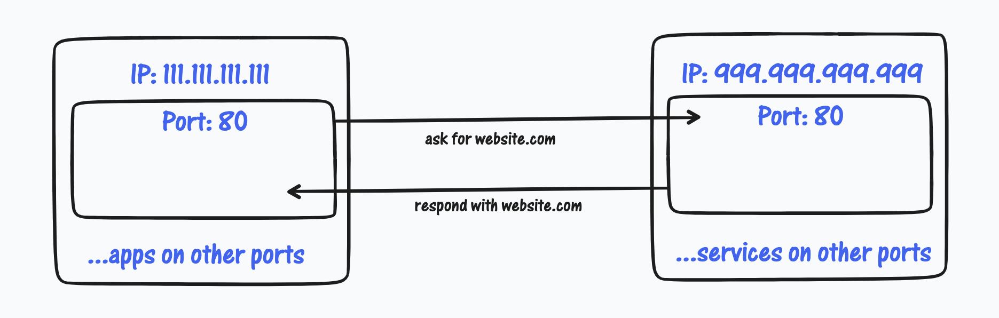
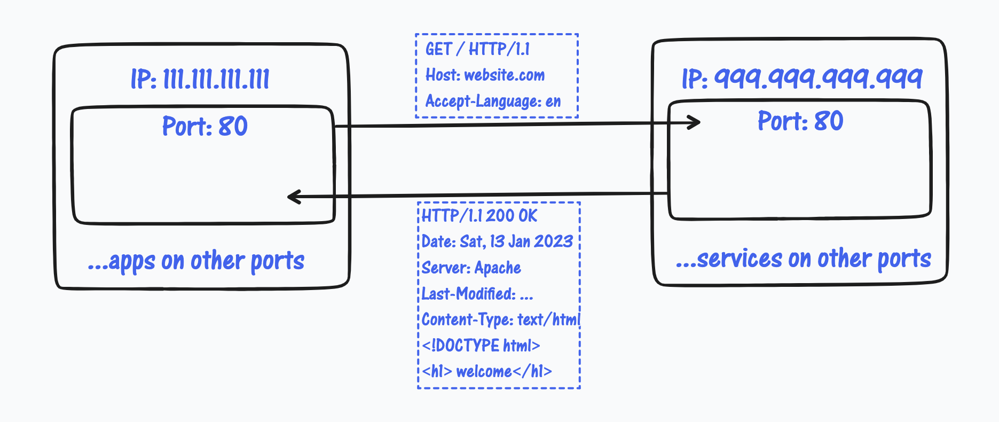
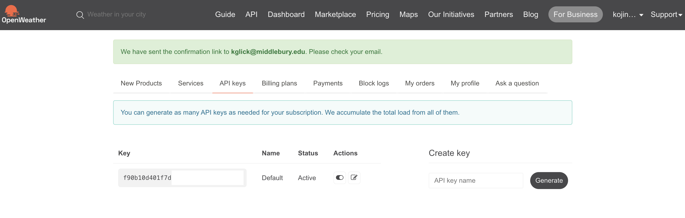

# Web Basics

---

### Agenda:
- how computers talk to each other
  - IP/TCP
  - HTTP
- how we can facilitate this communication
  - APIs/Web APIs
- hand-on practice
  - building a weather forecaster using [OpenWeather](https://openweathermap.org/)

---
## The Basic Model



---
## Introducing the IP and TCP layers



TL;DR: TCP/IP is the information you put on an envelope before sending.

---

## Introducing the HTTP layer



TL;DR: HTTP is the information you put in an envelope.

---

- HTTP: Hyper Text Transfer Protocol
  - A set of rules dictating how computers should talk to each other.
- HTML: Hyper Text Markup Language
  - A language designed to visually organize information information.

when you ask for a webpage, your browser makes an HTTP requests for an HTML page.

---
## APIs

almost every web page, once loaded, accesses more information from elsewhere. 
- security
  - you can secure information with an API, whereas the browser may be compromised.
  - authenticated requests
- user experience
  - people like to interact with the services they use
  - people like scrolling, and you better have new information for them when they do!
  - POST requests

---

they also access information via Web APIs which may or may not be open
- API: Application Programming Interfaces
  - we've already interacted with non-web APIs! (random, scamp, etc)
  - web APIs make use of the internet to achieve their intended function

---
## Web APIs

Web APIs offer us access to remote databases in a structured way.

Requests are often encoded in URLs as `base` + `endpoint` + `parameters`:
- base: `https://api.service.com/v1`
- endpoint: `/get_something`
- parameter: `?parameter=some_value&another_field=another_value`

---
Responses are typically serialized in JSON
- JSON: Java(S)cript Object Notation
- think of it like a `dict` you can send over the internet.
- example: 
    ```JSON
    {
        "data": {
            "some_data": ["data1", "data2"]
        },
        "meta": {
            "access_timestamp": 1672873648
        }
    }
- don't worry, there are built-in modules like `requests` that can handle this for us!
  
---

Web APIs are often secured by API keys.
- being able to hit an endpoint as many times as people want can be dangerous for the API's infrastructure. 
- Some APIs are restricted to use by certain paying customers
- Some APIs are free, but rate-limited (only x number of requests per day)

Many services allow you to apply for an API key (Twitter, etc.)


---
# Activity

how do we use web APIs?

first, let's make sure we have an account by [signing up with OpenWeather](https://home.openweathermap.org/users/sign_up)

when we have our account, let's make an API key:



---

make sure you're in the right directory:
```bash
$ ls
02_web_basics.md        png                     src
```
start the virtual environment
```bash
$ python3 -m venv env
$ source env/bin/activate
```
install `requests` and `python-dotenv`
```bash
$ pip install requests python-dotenv
```
---

the `python-dotenv` module allows us to store sensitive information, like our login credentials or API keys without exposing them in our source code.

since we don't want to leak our API keys accidentally, we'll store our key in an "environmental variable"

in the Terminal, we'll create our `.env` file which stores our environmental variables

```bash
$ touch .env
```

open the .env file, and add the following line:
```env
WEATHER_API_KEY=f90b10d401f7d...
```

---

we can check if our environmental variables are working in `src/a_apis.py`

```python
# load_dotenv() takes our .env file and makes it accessible
from dotenv import load_dotenv

# the os module allows us to access our environmental variables
import os

load_dotenv()

print(f'my API Key is {os.getenv("WEATHER_API_KEY")}')

```

if you see your API key printed, it's working!

`NOTE`: Remember to avoid sharing or leaking your API key!

---

let's try out the [Geocoding API from OpenWeather](https://openweathermap.org/api/geocoding-api)

this service allows us to learn more about the city that we enter, like the latitude, longitude, state, country, and other localized names

`NOTE`: by reading the documentation, we can learn exactly how to structure our requests

---

let's add `requests` to our imports, and remove the print line.

```python
# load_dotenv() takes our .env file and makes it accessible
from dotenv import load_dotenv

# the os module allows us to access our environmental variables
import os

# the request module gives us access to a lot of useful methods making requests
import requests
```

remember to load our environmental variables!

```python
load_dotenv()
```

---

let's implement the code that requests JSON data about Monterey.

```python
city_name = "Monterey"

city_base = 'http://api.openweathermap.org/geo/1.0'
city_endpoint = '/direct'
city_params = f'?q={city_name}&appid={os.getenv("WEATHER_API_KEY")}'

# city_response stores the full response back from the API
city_response = requests.get(f'{city_base}{city_endpoint}{city_params}')

# city_json stores the response payload
city_json = city_response.json()

print(city_json)
```
---

the output, when cleaned, should look like this: 

```JSON
[
  {
    'name': 'Monterey', 
    'local_names': {'uk': 'Monterey', 'zh': '蒙特雷', 'en': 'Monterey', ...}, 
    'lat': 36.600256, 
    'lon': -121.8946388, 
    'country': 'US', 
    'state': 'California'
    }
]
```
this looks like it's a `dict` wrapped in a `list`!

---

we'll store the latitude and longitude in a tuple
```python
latlong = (city_json[0]['lat'], city_json[0]['lon'])

print(f'Coordinates: {latlong}')
```

now we have all the information we need to access a weather forecast!

---

# Exercise

in order to assist in making better decision about what to wear during a holiday, you are tasked with building a command-line interface that pulls the weather forecast.

use [OpenWeather](https://openweathermap.org/) and/or [Teleport](https://developers.teleport.org/api/) to display the mid-day temperature, weather (clear, rainy, etc), and wind-speed.

`HINT`: you can ask for user input with the `input()` built-in function. 

- try replacing:
  ```python
  city_name = "Monterey"
  ```

- with:
  ```python
  print('Please input a city')
  city_name = input()
  ```