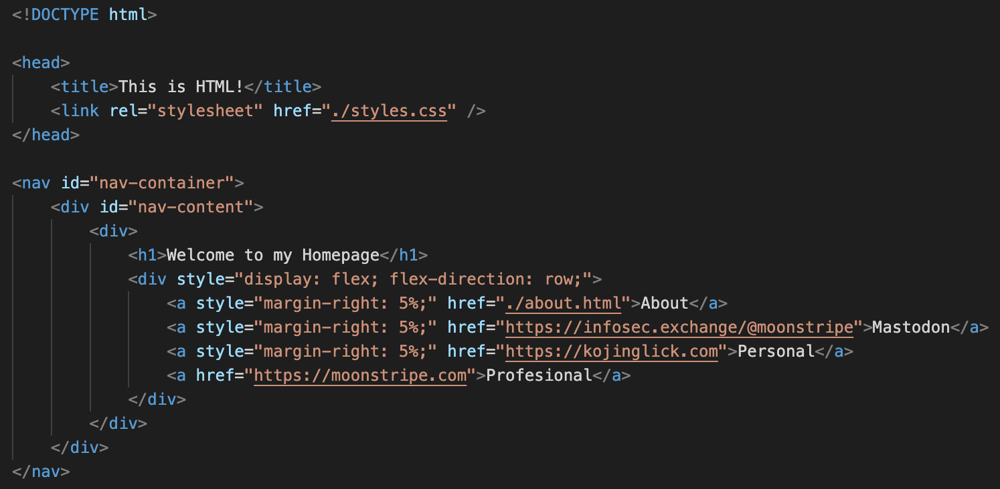
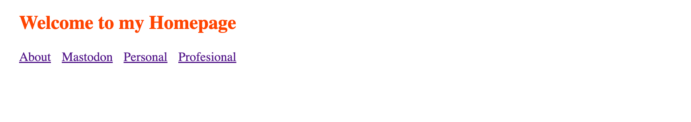

# Basics of Scraping the Web

---

at this point, data availability is not an issue
- the internet is rife with all sorts of data

the issue becomes finding and parsing that data
  
**in addition to accessing information through APIs, we can comb the documents (HTML) that make up the internet**

Web scraping is the process of batch loading **HTML pages** and using the **Document Object Model** to make sense of the semantic content of the page.

---

## HTML Crash Course

In HTML, we organize information from top to bottom, and use tags or "elements" to convey meaning.


[]()
[]()
[]()
[]()
[]()
[]()
This tree of information is called the **Document Object Model**

Our browsers parse this information, including accessing references to styling (CSS) and functionality (JavaScript)

---

## Using `beautifulsoup4`

go to the right directory, start a virtual environment and install the required libraries

```bash
$ ls
03_scraping_basics.md   env                     html_css_js             png                     src
$ python3 -m venv env
$ source env/bin/activate 
(env) $ pip install requests beautifulsoup4
```

---

let's also set up our `a_html_scrape.py`
```python
# This will allow us to pull the required HTML pages
import requests

# This library will allow us to parse HTML
from bs4 import BeautifulSoup

local_HTML = requests.get('http://127.0.0.1:5500/html_css_js/index.html').text

soup = BeautifulSoup(local_HTML)

print(soup.prettify())
```

running the script, you should see "prettified HTML", or HTML that is indented

with our BeautifulSoup object, `soup`, we can now find information...

---

by tag:
```python
# get all 'anchor' elements
links = soup.find_all('a')

print(f'Anchor Elements: {links}')

# find the urls from the links
hrefs = [ a.get('href') for a in links ]

print(f'URLs: {hrefs}')
```

---

by id:
```python
# get one element with `id=paragraph-1`
para_1 = soup.find(id="paragraph-1")

print(f'Paragraph 1 Element: {para_1}')

# pull the text content
print(f'Paragraph 1 Text: {para_1.get_text()}')
```

`NOTE`: ids tend to be unique to specific elements. also, typically used by JS

---

by class:
```python
# get one element with the 'main-content' class
main_content = soup.find(class_="main-content")

print(f'Main Content Element: {main_content}')

# pull the text in the children of the 'main-content' div
print('Pulling Text from children of "main_content"')
for i in main_content.children:
    print(f'{i.get_text()}')
```

`NOTE`: classes are often aree applied to many elements to style similar items with the same CSS.

---
## Activity

let's find out how much money Democrats spent on the 2022 Midterm Election cycle

```python
open_secrets_2022_url = "https://www.opensecrets.org/elections-overview?cycle=2022"

open_secrets_2022_text = requests.get(open_secrets_2022_url).text

soup = BeautifulSoup(open_secrets_2022_text, features="html.parser")
```

now we need to manually look over the HTML, trying to find a replicable way of getting the total dollar value of donations in both House and Senate races.


---

looks like the data we need are stored in a [table](https://developer.mozilla.org/en-US/docs/Web/HTML/Element/table) element.

```HTML
            ...
            <table>
                <tbody>
                    <tr>
                        <td class="category -color-blue" >
                            Democrats 
                        </td>
                        <td class="number">
                            $982,522,359
                        </td>
                        <td class="number">
                            50.93%
                        </td>
                    </tr>
                    <tr>
                        <td class="category -color-red" >
                            Republicans 
                        </td>
                        <td class="number">
                            $940,531,182
                        </td>
                        <td class="number">
                            48.75%
                        </td>
                    </tr>
                    ...
                </tbody>
            </table>
            ...
```

---

The specific dollar values are siblings to a cell with a class of `category -color-blue` so we can fetch them like this:

```python
# start with the row headers with the class="category -color-blue"
# this will pull both House and Senate data
dem = soup.find_all(class_='category -color-blue')

total = 0

# This loops through the House and Senate Data, ...
for chamber_table in dem:
    # ... fetching the sibling which stores the dollar value.
    fundraising_d_raw = chamber_table.find_next_sibling().get_text()

    # clean the text: remove newline separators, 
    # whitespace, commas, and the dollar sign, 
    # and turn it into a number so we can math
    fundraising_d_clean = int(fundraising_d_raw
                            .replace("\n", "")
                            .replace(",", "")
                            .replace("$", "")
                            .strip())
    total = total + fundraising_d_clean

print(f'Democrats spent ${"{:,}".format(total)} in 2022')
```
---

## Exercise

Using your knowledge of GET requests and BS4, find the total dollar value of donations to both Democrats and Republicans from 1990 through 2022.


`HINT`: look at the URL we used for our activity, maybe we can replace that with a formatted string?

---

## Limitations of BS4

BS4 isn't a full client, so it won't run the JavaScript.
- if a page uses dynamic content, then BS4 won't capture the changes made in JS

---

### Example:

if we open `index.html` in the browser, there are three paragraphs.


but when we try to fetch that third paragraph with BS4:
```python
# fetch the element with 'id=paragraph-2'
para_3 = soup.find("p", id='paragraph-3')

print(para_3.get_text())
```

we don't get anything...

---

when we open a webpage in the browser,

1. our browser reads the HTML **<- BS4 pulls from here**
2. our browser loads the CSS
3. our browser loads and executes the JavaScript **<- browser shows the JS mutation**
